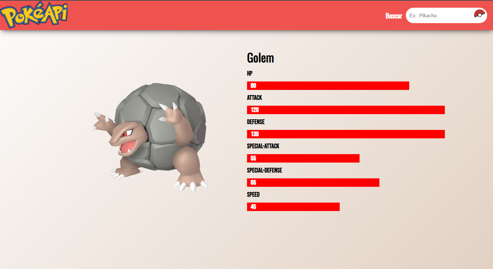

# Seja bem vindo

Esse app foi utilizado algumas dependências:

    "axios": "^0.27.2",
    "node-sass": "^7.0.1",
    "react-router-dom": "^6.3.0",

A API foi [https://pokeapi.co/](PokéAPI)

Para testar siga os seguintes passos:

## `npm install`
## `npm start`

