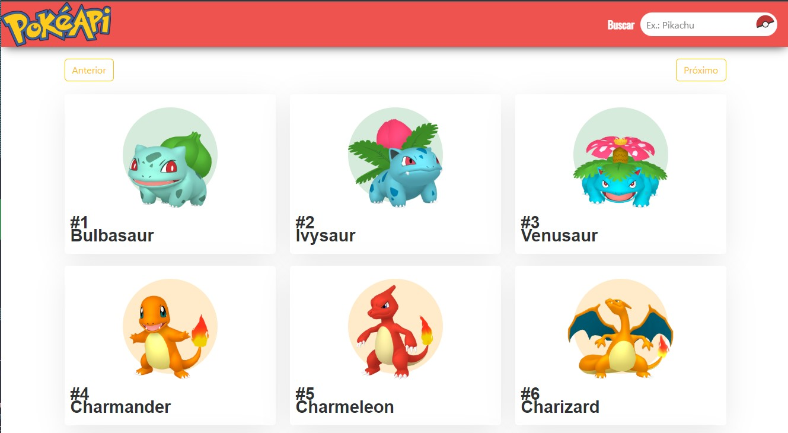

<h1 align="center"> PokeLoja </h1>

Esse app foi utilizado algumas dependências:

"axios": "^0.27.2",
    "bootstrap": "^5.2.0"
     
    "chart.js": "^3.9.1"
     
    "node-sass": "^7.0.1"
     
    "react": "^18.2.0"
     
    "react-bootstrap": "^2.5.0"
     
    "react-chartjs-2": "^4.3.1"
     
    "react-dom": "^18.2.0"
     
    "react-router-dom": "^6.3.0",

A API foi [https://pokeapi.co/](PokéAPI)

Utilizei uma paleta de cores do site:
[https://paletadecores.com](https://paletadecores.com/)

Para testar siga os seguintes passos:

    npm install
    npm start

